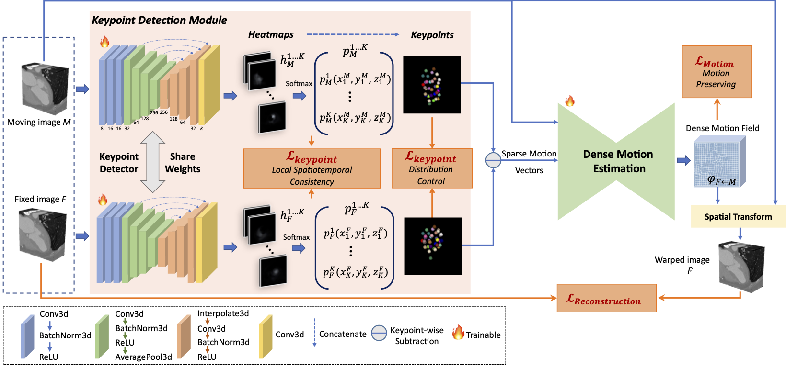

# STCMT-Net-for-Cardiac-Motion-Estimation
This repository contains the source code of “A Spatiotemporal Consistency Motion Transfer Network for Enhancing Cardiac Motion Estimation”.

## Overview

Coming soon.
